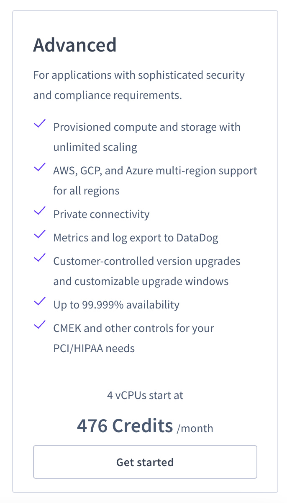
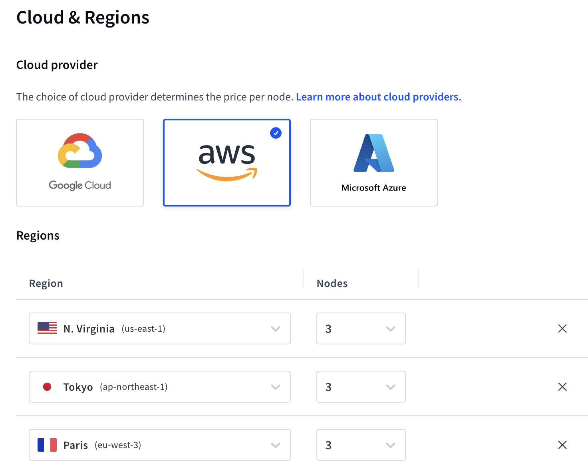
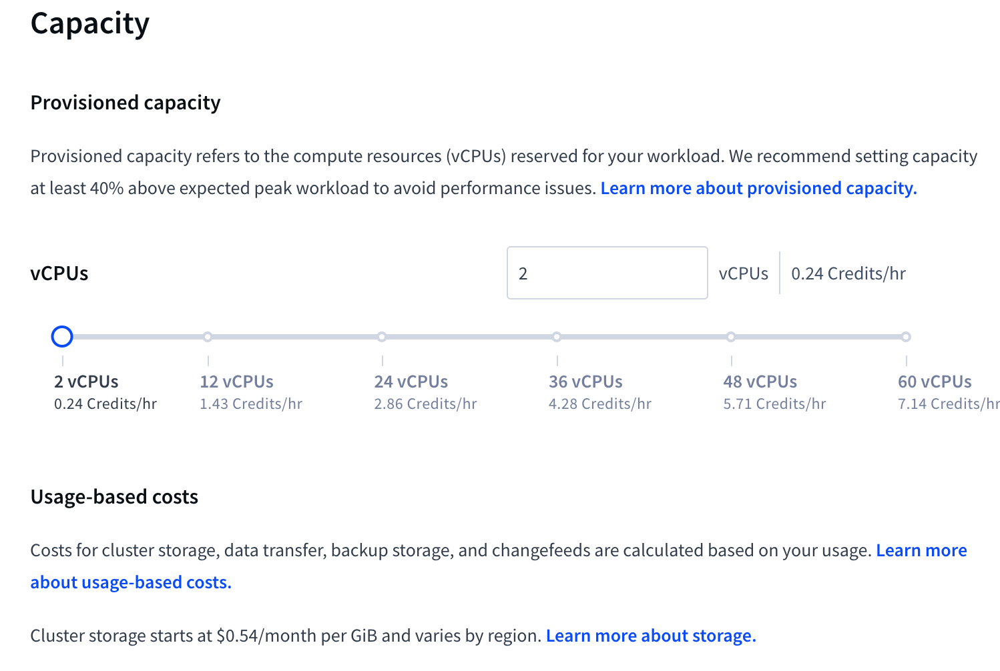
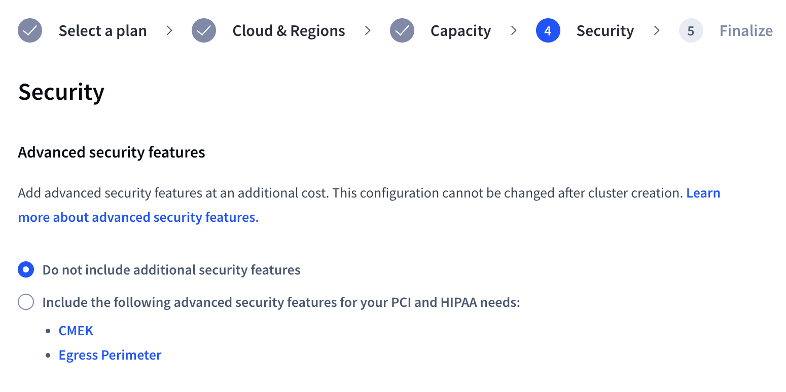
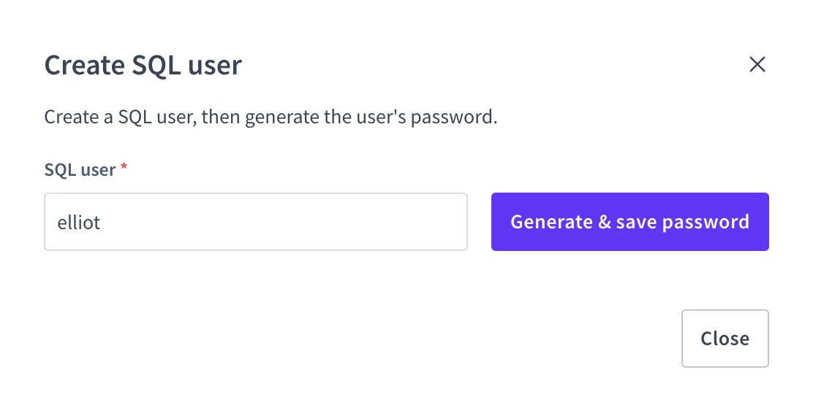
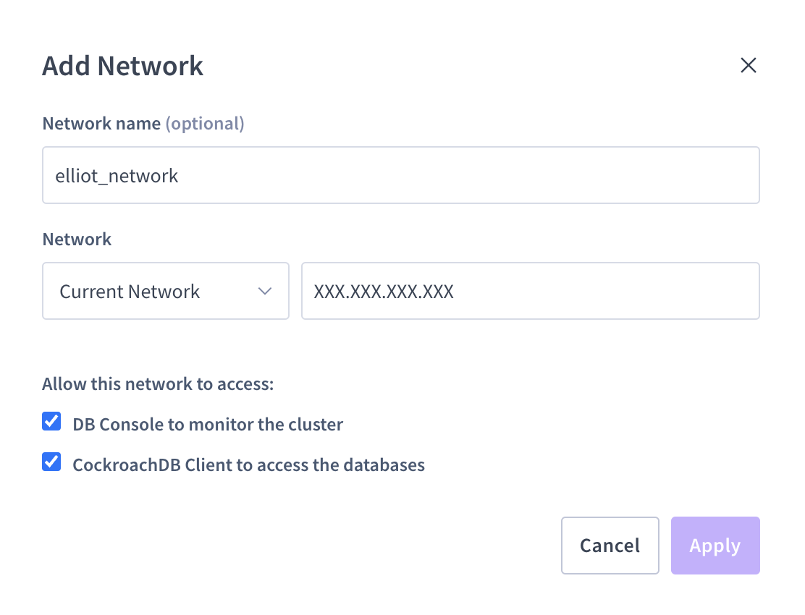
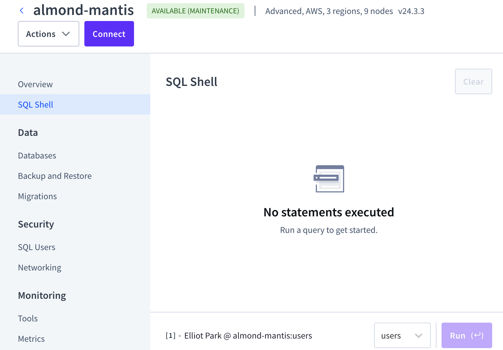

# Crunch & Code: CockroachDB Global User Database Challenge 🌎
Welcome to the CockroachDB Global User Database Challenge! In this 1 hour challenge, you will configure a multi-region user database that demonstrates data locality and regional survivability.


## Prize 💵
**$300 USD** for the winner

## Challenge Overview
Transform a user database into a global system by implementing data locality that:
- Routes user data to a specific location
- Survives regional failures


## Prerequisites
- [Registration](https://docs.google.com/forms/d/e/1FAIpQLSdfG-23NPmiWGELBjlEGl3J43eGkEBnKPMRqRxdAraEi5Fmmw/viewform)
- GitHub account
- Basic SQL knowledge
- [CockroachDB Cloud](https://cockroachlabs.cloud/)


## Getting Started

### 1. Initial Setup
1. Create a Github repository named "Crunch-Code"
2. Create a [CockroachDB Cloud](https://cockroachlabs.cloud/) **Advanced** account
   - Trial includes $400 in credits

### 2. Useful Documentation
- [CockroachDB Quickstart Guide](https://www.cockroachlabs.com/docs/cockroachcloud/quickstart)
- [Table Localities Documentation](https://www.cockroachlabs.com/docs/stable/table-localities)
- [Multi-Region Survival Goals](https://www.cockroachlabs.com/docs/stable/multiregion-survival-goals)
- [EXPLAIN ANALYZE Documentation](https://www.cockroachlabs.com/docs/stable/explain-analyze)


## Setup

### 1. Cluster Configuration
Set up a [CockroachDB Cloud](https://cockroachlabs.cloud/) **Advanced** account with the following specifications. It takes ~30 minutes to provision the cluster:

<kbd>
    
</kbd>

#### Cloud Provider:
AWS

#### Multiple Regions
- Paris, France
- Tokyo, Japan
- North Virginia, USA

<kbd>
    
</kbd>

#### Hardware Specifications
- Compute per node: 4 vCPU & 16 GB RAM
- Storage per node: 35 GiB

<kbd>
    
</kbd>

#### Security
- Select "Do not include additional security features"

<kbd>
    
</kbd>

#### Accessing
1. **Cluster Provisioning**:
Wait 30 minutes for the cluster to provision

2. **SQL User Setup**:
   - Go to CockroachDB Console → SQL Users
   - Create and save SQL user credentials

<kbd>
    
</kbd>

3. **Network Configuration**:
   - Go to CockroachDB Console → Networking
   - Create a network name and add your current network
   - Enable access for DB Console and CockroachDB Client

<kbd>
    
</kbd>

### 2. Database Setup
Access the SQL Shell in CockroachDB Console:

<kbd>
    
</kbd>

Execute the following commands to set up your database:

1. Create database:
```sql
CREATE DATABASE IF NOT EXISTS users;
```
2. Select database:
```sql
USE users;
```
3. Create tables:
```sql
CREATE TABLE global_users (
    id UUID PRIMARY KEY DEFAULT gen_random_uuid(),
    name STRING NOT NULL,
    email STRING UNIQUE NOT NULL,
    city STRING NOT NULL,
    created_at TIMESTAMP DEFAULT current_timestamp(),
    CONSTRAINT email_valid CHECK (email ~* '^[A-Za-z0-9._%+-]+@[A-Za-z0-9.-]+\.[A-Za-z]{2,}$')
);

CREATE TABLE regional_users (
    id UUID PRIMARY KEY DEFAULT gen_random_uuid(),
    name STRING NOT NULL,
    email STRING UNIQUE NOT NULL,
    city STRING NOT NULL,
    created_at TIMESTAMP DEFAULT current_timestamp(),
    CONSTRAINT email_valid CHECK (email ~* '^[A-Za-z0-9._%+-]+@[A-Za-z0-9.-]+\.[A-Za-z]{2,}$')
);

CREATE TABLE regional_by_row_users (
    id UUID PRIMARY KEY DEFAULT gen_random_uuid(),
    name STRING NOT NULL,
    email STRING UNIQUE NOT NULL,
    city STRING NOT NULL,
    created_at TIMESTAMP DEFAULT current_timestamp(),
    CONSTRAINT email_valid CHECK (email ~* '^[A-Za-z0-9._%+-]+@[A-Za-z0-9.-]+\.[A-Za-z]{2,}$')
);
```

4. Insert sample data:
```sql
INSERT INTO global_users (name, email, city) VALUES
    ('Michael Cohen', 'michael.cohen@gmail.com', 'Richmond'),
    ('Sarah Rodriguez', 'sarah.r@outlook.com', 'Richmond'),
    ('David Chang', 'david.chang@yahoo.com', 'Richmond'),
    ('Rachel Goldman', 'rachel.goldman@gmail.com', 'Richmond'),
    ('Anthony DiMarco', 'tony.dimarco@outlook.com', 'Richmond'),
    ('Marie Dubois', 'marie.dubois@orange.fr', 'Paris'),
    ('Jean-Pierre Moreau', 'jp.moreau@gmail.com', 'Paris'),
    ('Amélie Laurent', 'amelie.laurent@free.fr', 'Paris'),
    ('François Bernard', 'f.bernard@laposte.net', 'Paris'),
    ('Sophie Lefebvre', 'sophie.lefebvre@orange.fr', 'Paris'),
    ('Yuki Tanaka', 'tanaka.yuki@softbank.ne.jp', 'Tokyo'),
    ('Hiroshi Sato', 'sato.hiroshi@docomo.ne.jp', 'Tokyo'),
    ('Akiko Yamamoto', 'yamamoto.akiko@yahoo.co.jp', 'Tokyo'),
    ('Kenji Nakamura', 'nakamura.k@gmail.com', 'Tokyo'),
    ('Sakura Suzuki', 'suzuki.sakura@softbank.ne.jp', 'Tokyo');


INSERT INTO regional_users (name, email, city) VALUES
    ('Daniel Shapiro', 'dan.shapiro@gmail.com', 'Richmond'),
    ('Emily Santos', 'emily.santos@outlook.com', 'Richmond'),
    ('Michael Patel', 'mpatel@yahoo.com', 'Richmond'),
    ('Rebecca Liu', 'rebecca.liu@gmail.com', 'Richmond'),
    ('Christopher Burke', 'chris.burke@outlook.com', 'Richmond'),
    ('Sofia Rossi', 'sofia.rossi@gmail.com', 'Richmond'),
    ('James McDonnell', 'james.odonnell@yahoo.com', 'Richmond'),
    ('Amanda Chen', 'amanda.chen@gmail.com', 'Richmond'),
    ('Andrew Kim', 'akim@outlook.com', 'Richmond'),
    ('Lauren McCarthy', 'lauren.mc@gmail.com', 'Richmond'),
    ('David Cohen', 'dcohen@yahoo.com', 'Richmond'),
    ('Victoria Nguyen', 'victoria.n@gmail.com', 'Richmond'),
    ('Ryan Martinez', 'ryan.martinez@outlook.com', 'Richmond'),
    ('Sarah Goldman', 'sgoldman@gmail.com', 'Richmond'),
    ('Thomas Park', 'thomas.park@yahoo.com', 'Richmond');


INSERT INTO regional_by_row_users (name, email, city) VALUES
    ('Alexandra Patel', 'alex.patel@gmail.com', 'Richmond'),
    ('Marcus Washington', 'marcus.w@outlook.com', 'Richmond'),
    ('Jennifer Kim', 'jennifer.kim@yahoo.com', 'Richmond'),
    ('Brandon Hughes', 'brandon.oconnor@gmail.com', 'Richmond'),
    ('Maya Santos', 'maya.santos@outlook.com', 'Richmond'),
    ('Lucie Garnier', 'l.garnier@free.fr', 'Paris'),
    ('Nicolas Petit', 'nicolas.petit@orange.fr', 'Paris'),
    ('Camille Roux', 'camille.roux@laposte.net', 'Paris'),
    ('Thomas Leroy', 't.leroy@gmail.com', 'Paris'),
    ('Claire Dupont', 'claire.dupont@orange.fr', 'Paris'),
    ('Riku Watanabe', 'watanabe.riku@docomo.ne.jp', 'Tokyo'),
    ('Aoi Ishikawa', 'ishikawa.aoi@softbank.ne.jp', 'Tokyo'),
    ('Takeshi Kimura', 'kimura.takeshi@yahoo.co.jp', 'Tokyo'),
    ('Yumi Kobayashi', 'kobayashi.yumi@gmail.com', 'Tokyo'),
    ('Kaito Matsuda', 'matsuda.kaito@docomo.ne.jp', 'Tokyo');
```

## The Challenge 💻
* Configure `REGIONAL BY ROW` locality in `regional_by_row_users` table
* Configure `REGIONAL BY TABLE` locality in `regional_users` tables
* Configure `GLOBAL` table locality in `global_users` tables
* Implement regional survivability for `users` database
* Create indexes for query optimization
* Any other optimizations (optional)

## Submission Requirements
1. Create a GitHub repository with a README
   * Include screenshots showing SQL commands and outputs verifying:
     * Regional by row tables
     * Regional tables
     * Global tables
     * Regional survivability
     * Indexes
     * Other optimizations (optional)
2. Email your Github repository to: [ben.sherrill@cockroachlabs.com](mailto:ben.sherrill@cockroachlabs.com)
3. Delete your cluster after submission

## Judging Criteria
Total: 100 points

| Category | Points | Description |
|----------|--------|-------------|
| Implementation | 40 | Correct setup and configuration |
| CockroachDB Features | 40 | Effective use of platform capabilities |
| Performance | 20 | Query optimization and efficiency |


## Questions
For any questions or clarifications, contact elliot.park@cockroachlabs.com
